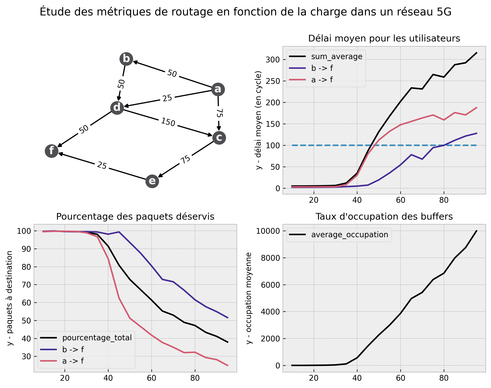

# Simulation et Analyse des métriques dans un réseau sans 

## Note developpeur

### Intégration

Version de python utilisé : `Python 3.10.2`

Ci-dessous, la liste des majeures librairies utilisées :
1. [numpy](https://numpy.org/) pour la génération de nombre pseudo-aléatoire ;
2. [pandas](https://pandas.pydata.org/) pour la lecture des scénarii au format csv ;
3. [network](https://networkx.org/) pour la manpilation de graph ;
4. [matplotlib.pyplot](https://matplotlib.org/) pour la visualisation des données sous formes de graphiques.

### Démarrage

La méthode main est contenue dans le fichier [sources/main.py](./sources/main.py). C'est le fichier d'entrée pour lancer l'applicaton : `Usage: python sources/main.py <scenario> <options*>`.

*scenario*: Le nom du fichier csv (sans extension). Le graph est construit à partir des données de la topolgie fournies via cet argument. Le fichier doit être dans le repertoire ressources/dataframes/.

*options*: Pour le moment, seule l'option *time* est impactante qui indique la durée des simulations. (Si pas renseignée, la boucle tourne à l'infini).

exemple: `python sources/main.py scenario_test2 time=500`

### Architecture

Ci-dessous, la décomposition en liste des dossiers pour une meilleure compréhension de l'architecture du projet.

1. sources/ : encapsule les fichiers de code ;
2. ressources/dataframes : répertorie toutes les topologies pour les différentes simulations ;
3. ressources/results : les graphiques sont rendus sous la forme d'image placées dans ce repertoire.

-----------------

## Présentation du sujet d'étude

### Objectif de la simulation

Comparer des solutions de routages capables de trouver (et choisir) le meilleur des chemins dans un système simple mais considérant des métriques différentes (parmis lesquels meilleur débit moyen, plus faible encombrement, plus court chemin, etc).

### Consigne

- Examiner leurs performance sur différents scénarii et conlure.
- Poursuivre en élaborant une solution combinant les différents avantages de chacune des solutions testées.

 

### Modélisation

Le programme lance autant de simulations qu'il y a de  protocoles, toutes sur la même topologie initiale. Donc chaque protocole a son instance du réseau dédiée dans laquelle à chaque tick sont générés des paquets depuis les sources vers leur destination. Le nombre de paquets créés varie selon la charge moyenne – ce nombre est tiré aléatoirement entre zero et deux fois la charge. En somme, la production de paquets varie autour de cette moyenne afin de recréer des problèmes de congestion temporaire.

La simulation est temps discret, elle dure un nombre pré-déterminé de ticks (cf. Démarrage). En principe, un tick représente la variation entre deux états consécutifs mais, ici, c'est l'unité de temps de la simulation. En effet, le nombre de tick de la simulation correspond au nombre de générations de paquets. Plus concrètement, un tick représente aussi le temps d'un saut entre deux noeuds du réseau. C'est aussi un outil de mesure, par exemple, les paquets sont estampilés à leur création afin de calculer le délai une fois à destination.

La route que vont emprunter les paquets est décidée en fonction du protocole de routage, soit au début de la simulation, soit depuis les noeuds à chaque tick, pour chaque couple (source, destination). Les buffers des noeuds sont des files FIFO dont l'ordre est respecté inconditionnellement.

Les débits sont tirés suivant une loi normale, autour d'une moyenne fournie dans les données de la topologie pour imiter naïvement les conditions radio dans le réseau. À noter que ces tirges aléatoires sont indépendents entre les différents réseaux de la simulation.

#### Simplifications

En contraste avec le routage dans le vie réelle, on est obligé de faire plusieurs simplifications qu'on pour facilitier les simulations :
- Nous considérons que tous les paquets sont de même taille pour faciliter les statistiques (afin de ne pas avoir à faire de moyenne pondérée) ;
- De même, les paquets sont rangés dans des files FIFO de capacité infinie.

### Protcoles

Les différentes métriques et protocoles implémentés sont : 

| N° | Nom du protocol         | Description de l'algorithme |
| :- |:----------------------: | :-------------------------- |
| 0  | OLSR                    | le meilleur débit moyen     |
| 1  | SHORTEST_PATH           | le plus court chemin        |
| 2  | LSOR                    | le meilleur débit moyen (en fonction des conditions radio) |
| 3  | MAX_BOTTLENECK          | le plus grand goulot d'étranglement |
| 4  | FASTEST_BUFFER          | le buffer le plus rapide (dont le premier paquet est le plus récent)   |
| 5  | EMPTIEST_BUFFER         | le buffer le moins rempli   |
| 6  | HYDRBID | la moyenne des élections avec SHORTEST_PATH, LSOR, MAX_BOTTLENECK, FASTEST_BUFFER |

## Résultats

Les résultats sont présentés sur des images découpées en quatre parties :
1. (en haut à gauche) la topologie du réseau avec quand le protocole le permet les routes décidées à l'initialisation ;
2. (en haut à droite) un graphique qui montre le délai moyen par utilisateur (la ligne bleue représente la limite de satisfaction) ;
3. (en bas à gauche) un graphique qui montre le pourcentage de paquets à destination par utilisateur ;
4. (en bas à droite) un graphique qui montre la moyenne de paquets dans les buffers.

## Analyse

Toutes les simulations ci-dessuos, tournent sur 500 ticks et la génération de paquets va de 10 à 100 avec un pas de 5.

## Conclusion
